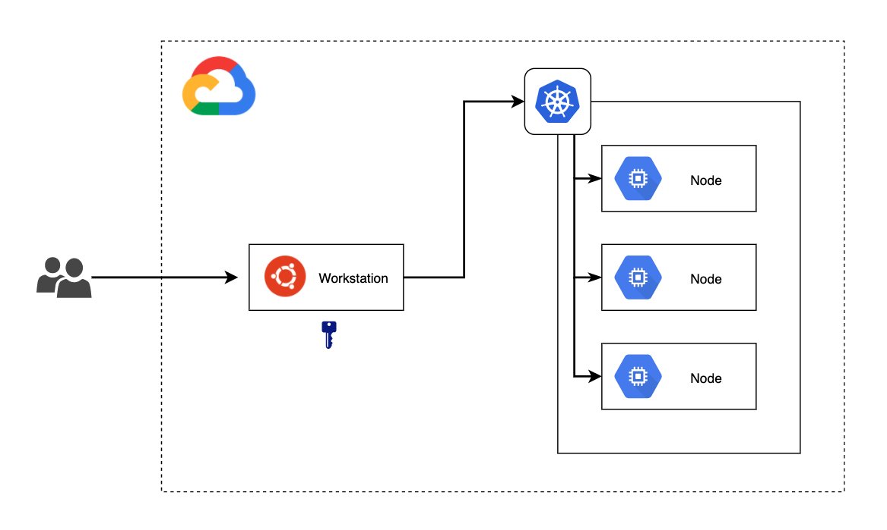

# Kubernetes Workshop
Lab 01: Setting Up Your Workstation

---

## Labs Infrastructure



## Instructions
 - Ask the instructor for the IP of your Bastion node
 ```
 Username: sela
 Password: sela
 ```
 
 - Connect to the Bastion node using SSH with the IP address provided by the instructor
 
```
ssh sela@<server-ip>
```

 - Install 'kubectl' using snap
```
sudo snap install kubectl --classic
```

 - Ensure kubectl is installed and check its version
```
kubectl version
```

 - Download youre newly created Kubernetes cluster credentials and configure kubectl
```
gcloud container clusters get-credentials $(hostname) --zone $(gcloud compute instances list --filter="name=$(hostname)" --format "value(zone)") --project devops-course-architecture
```

- Define the Kubernetes default text editor as NANO 
```
echo "export KUBE_EDITOR=\"nano\"" >>  ~/.bash_profile
```

- Define auto completion and aliases for Kubectl 
```
echo 'source <(kubectl completion bash)' >>~/.bash_profile
echo 'alias k=kubectl' >>~/.bash_profile
echo 'complete -F __start_kubectl k' >>~/.bash_profile
source ~/.bash_profile
```

 - Inspect current context
```
kubectl config get-contexts
```

 - Inspect kubectl configuration file
```
cat ~/.kube/config
```

 - List cluster nodes
```
kubectl get nodes
```

 - Inspect node details
```
kubectl describe node <node-name>
```

 - Get all cluster resources
```
kubectl get all --all-namespaces
```
