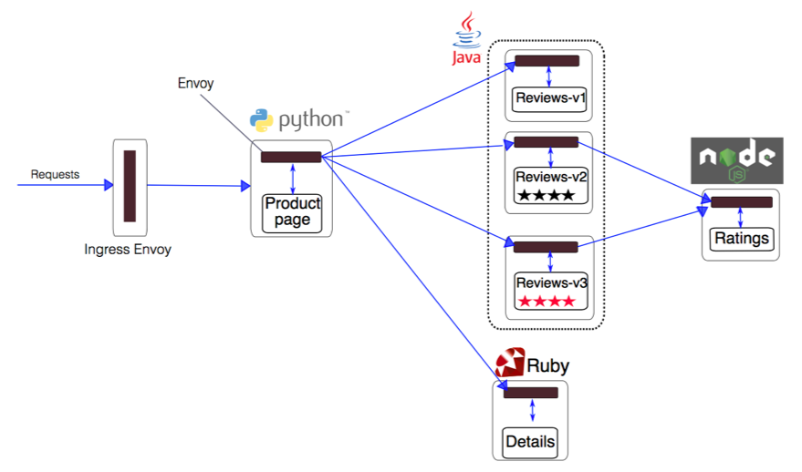

# Kubernetes Workshop
Lab 12: Managing Microservices with Istio

---

## Preparations

 - Provide at least 3 medium nodes + 1 large node

## Instructions

### Download and install istio cli

 - Set the version to download (we will use 1.5.2):
```
echo 'export ISTIO_VERSION="1.5.2"' >> ${HOME}/.bash_profile
source ${HOME}/.bash_profile
echo ${ISTIO_VERSION}
```

 - Download and install istio
```
mkdir ~/lab-12
cd ~/lab-12
curl -L https://istio.io/downloadIstio | sh -
```

 - Add to istioctl to the path
```
sudo mv -v ~/lab-12/istio-1.5.2/bin/istioctl /usr/local/bin/
```

 - Ensure istioctl was installed successfully
```
istioctl version --remote=false
```

### Install Istio's Core Components

 - Install istio components using the "Demo" profile:
```
istioctl manifest apply --set profile=demo
```

 - Verify that the services have been deployed using:
```
kubectl get svc -n istio-system
```

 - Check the corresponding pods with the following command:
```
kubectl get pods -n istio-system
```

### Deploying the sample app



 - Inspect the sample app resources
```
cat ~/lab-12/istio-1.5.2/samples/bookinfo/platform/kube/bookinfo.yaml
```

 - Deploy sample app by manually injecting istio proxy (you can allow automatic injection using the command "kubectl label namespace <namespace-name> istio-injection=enabled"):
```
kubectl apply -f <(istioctl kube-inject -f ~/lab-12/istio-1.5.2/samples/bookinfo/platform/kube/bookinfo.yaml)
```

 - Confirm pods, services are running correctly
```
kubectl get pod,svc
```

 - Inspect one of the applied deployments to see the injected sidecar
```
kubectl get deployment details-v1 -o yaml 
```


### Deploy the virtual service and ingress gateway

 - Inspect the virtual service and ingress gateway resources
```
cat ~/lab-12/istio-1.5.2/samples/bookinfo/networking/bookinfo-gateway.yaml
```

 - Deploy the resources
```
kubectl apply -f ~/lab-12/istio-1.5.2/samples/bookinfo/networking/bookinfo-gateway.yaml
```

 - Check that the resources were deployed successfully
```
kubectl get VirtualService,Gateway
```

### Access the application

 - Get the external IP of the ingress gateway
```
kubectl get service istio-ingressgateway -n istio-system
```

 - Browse to the product page
```
http://<ingress-gateway-external-ip>/productpage
```

 - Click reload multiple times to see how the layout and content of the reviews changes as differnt versions (v1, v2, v3) of the app are called
   - Version 1: doesn’t call the ratings service
   - Version 2: calls the ratings service, and displays each rating as 1 to 5 black stars
   - Version 3: calls the ratings service, and displays each rating as 1 to 5 red stars


### Intelligent Routing

 - Before you can use Istio to control the Bookinfo version routing, you’ll need to define the available versions, called subsets, in destination rules

 - Inspect the destination rules resource
```
cat ~/lab-12/istio-1.5.2/samples/bookinfo/networking/destination-rule-all.yaml
```

 - Deploy the destination rules resource
```
kubectl apply -f ~/lab-12/istio-1.5.2/samples/bookinfo/networking/destination-rule-all.yaml
```

#### Route to reviews:v1 only

 - To route to reviews:v1 only, apply a virtual services that set the default version for the microservice

 - Inspect the VirtualService resource
```
cat ~/lab-12/istio-1.5.2/samples/bookinfo/networking/virtual-service-all-v1.yaml
```

 - Apply the VirtualService resource
```
kubectl apply -f ~/lab-12/istio-1.5.2/samples/bookinfo/networking/virtual-service-all-v1.yaml
```

 - Try now to reload the page multiple times, and note how only version 1 of reviews is displayed each time


#### Route to reviews:v2 for specific user

 - Let's change the route configuration so that all traffic from the user "jason" will be routed to the service reviews:v2

 - Inspect the VirtualService resource
```
cat ~/lab-12/istio-1.5.2/samples/bookinfo/networking/virtual-service-reviews-test-v2.yaml
```

 - Apply the VirtualService resource
```
kubectl apply -f ~/lab-12/istio-1.5.2/samples/bookinfo/networking/virtual-service-reviews-test-v2.yaml
```

 - To test, click Sign in from the top right corner of the page, and login using jason as user name with a blank password. You will only see reviews:v2 all the time. Others will see reviews:v1


#### Use istio to test resiliency (delay)

 - Let's inject a 7s delay between the reviews:v2 and ratings microservices for user jason (this test will uncover a bug that was intentionally introduced into the Bookinfo app)

 - Inspect the VirtualService resource
```
cat ~/lab-12/istio-1.5.2/samples/bookinfo/networking/virtual-service-ratings-test-delay.yaml
```

 - Apply the VirtualService resource
```
kubectl apply -f ~/lab-12/istio-1.5.2/samples/bookinfo/networking/virtual-service-ratings-test-delay.yaml
```

 - Logout, then click Sign in from the top right corner of the page, using jason as the user name with a blank password. You will see the delays and it ends up display error for reviews. Others will see reviews without error


#### Use istio to test resiliency (abort)

 - To test for another resiliency, introduce an HTTP abort to the ratings microservices for the test user jason

 - Inspect the VirtualService resource
```
cat ~/lab-12/istio-1.5.2/samples/bookinfo/networking/virtual-service-ratings-test-abort.yaml
```

 - Apply the VirtualService resource
```
kubectl apply -f ~/lab-12/istio-1.5.2/samples/bookinfo/networking/virtual-service-ratings-test-abort.yaml
```

 - To test, click Sign in from the top right corner of the page and login using jason for the user name with a blank password. As jason you will see the error message. Others (not logged in as jason) will see no error message


#### Gradually migrate traffic

 - Let's send 50% of traffic to reviews:v1 and 50% to reviews:v3

 - Inspect the VirtualService resource
```
cat ~/lab-12/istio-1.5.2/samples/bookinfo/networking/virtual-service-reviews-50-v3.yaml
```

 - Apply the VirtualService resource
```
kubectl apply -f ~/lab-12/istio-1.5.2/samples/bookinfo/networking/virtual-service-reviews-50-v3.yaml
```

 - To test it, refresh your browser over and over, and you’ll see only reviews:v1 and reviews:v3 (without sign in)

 - Assuming you decide tat the reviews:v3 microservice is stable, you can route 100% of the traffic to it:
```
cat ~/lab-12/istio-1.5.2/samples/bookinfo/networking/virtual-service-reviews-v3.yaml
kubectl apply -f ~/lab-12/istio-1.5.2/samples/bookinfo/networking/virtual-service-reviews-v3.yaml
```

### Monitor and Visualize

#### Allow access to istio add-ons systems

 - Edit the services below to update the service type from ClusterIP to LoadBalancer

```
kubectl patch svc kiali -p '{"spec": {"type": "LoadBalancer"}}' -n istio-system
```
```
kubectl patch svc prometheus -p '{"spec": {"type": "LoadBalancer"}}' -n istio-system
```
```
kubectl patch svc tracing -p '{"spec": {"type": "LoadBalancer"}}' -n istio-system
```
```
kubectl patch svc grafana -p '{"spec": {"type": "LoadBalancer"}}' -n istio-system
```

 - Wait for all the load balancer to be created and retrieve the external ip of the services above
```
kubectl get services kiali prometheus tracing grafana -n istio-system
```

#### Collecting new telemetry data 

 - Add a metric and log stream that Istio will generate and collect automatically.
```
kubectl apply -f ~/lab-12/istio-1.5.2/samples/bookinfo/telemetry/metrics.yaml
```

 - Get the external IP of the ingress gateway
```
kubectl get service istio-ingressgateway -n istio-system
```

 - In a new terminal run the below in order to send a traffic to the mesh
```
while true; do curl -o /dev/null -s "http://<ingress-gateway-external-ip>/productpage"; done
```

#### Inspect the grafana dashboard

 - Get the external IP of the grafana service
```
kubectl get svc grafana -n istio-system
```

 - Browse to grafana
```
http://<grafana-ip>:3000
```

 - Open the istio-mesh-dashboard to see that the traffic is evenly spread between reviews:v1 and reviews:v3


#### Inspect prometheus

 - Get the external IP of the prometheus service
```
kubectl get svc prometheus -n istio-system
```

 - Browse to prometheus
```
http://<prometheus-ip>:9090
```

 - Go to status/targets to check what it's been monitored


#### Inspect kiali

 - Create a username variable for kiali (admin)
```
KIALI_USERNAME=$(read -p 'Kiali Username: ' uval && echo -n $uval | base64)
```

 - Create a password variable for kiali (admin)
```
KIALI_PASSPHRASE=$(read -sp 'Kiali Passphrase: ' pval && echo -n $pval | base64)
```

 - Create a secret to store kiali credentials
```
cat <<EOF | kubectl apply -f -
apiVersion: v1
kind: Secret
metadata:
  name: kiali
  namespace: istio-system
  labels:
    app: kiali
type: Opaque
data:
  username: $KIALI_USERNAME
  passphrase: $KIALI_PASSPHRASE
EOF
```

 - Get the kiali pod name
```
kubectl get pods -n istio-system | grep kiali
```

 - Delete the kiali pod to recreate it
```
kubectl delete pod -l app=kiali -n istio-system
```

 - Wait until the kiali pod is recreated
```
kubectl get pods -n istio-system 
```

 - Get the external IP of the kiali service
```
kubectl get svc kiali -n istio-system
```

 - Browse to kiali
```
http://<kiali-ip>:20001/kiali/console
```

 - Login with the credentials below
```
username: admin
password: admin
```

 - Browse to "Graph", select the default namespace and explore the graph


#### Inspect jaeger (tracing)

 - Get the external IP of the tracing service
```
kubectl get svc tracing -n istio-system
```

 - Browse to jaeger
```
http://<tracing-external-ip>
```

 - Select the "reviews.default" service and click "Find traces", then explore the results


### Cleanup

 - List existent resources
```
kubectl get all
```

 - Delete existent resources
```
kubectl delete all --all
```

 - Uninstall istio
```
helm delete istio-init
```
```
kubectl delete namespace istio-system
```

 - List existent resources
```
kubectl get all
```